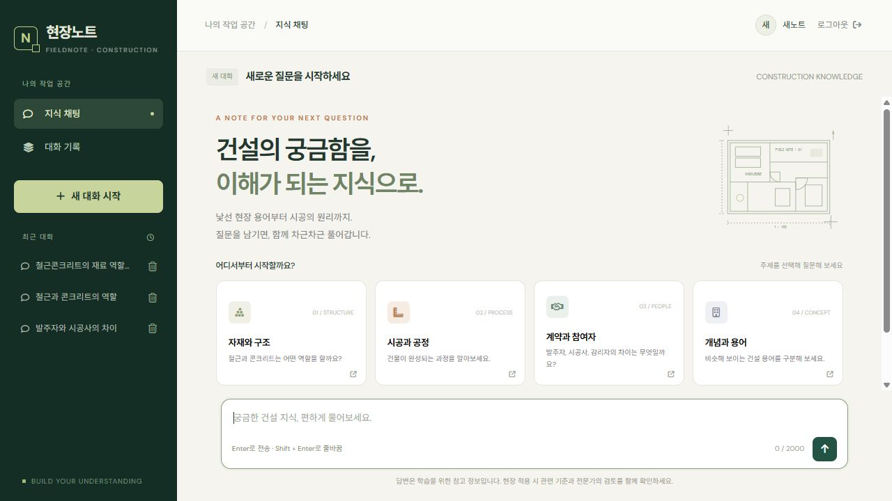
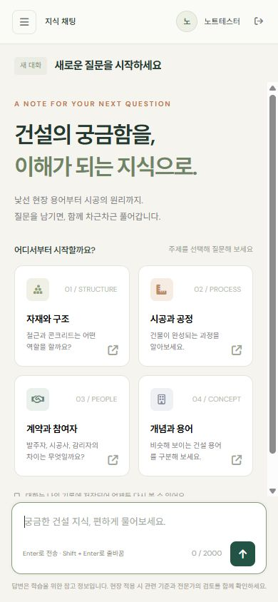
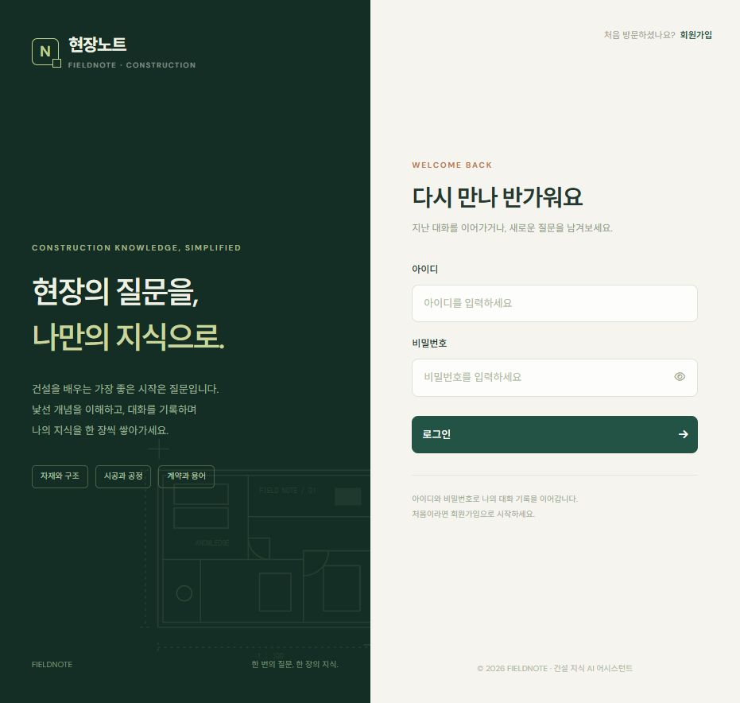

# 현장노트 UI 리뷰 안내

기존 데모 화면을 건설 지식 학습용 화면으로 개편했습니다. 기존 API 주소, JWT 저장 키, 가입·로그인 요청과 채팅·세션 기능을 유지합니다. 서버 AI 키나 데이터베이스는 변경하지 않습니다.

## 먼저 확인할 화면

1. **채팅**: 최근 대화와 새 질문을 구분하고, 건설 주제 4개에서 질문을 시작합니다. AI 답변의 표·목록과 복사 기능을 확인합니다.
2. **대화 기록**: 전체 질문·대화 통계, 현재 페이지 검색, 상태 필터, 50개 단위 페이지 이동과 전체 내용 보기입니다. 검색/질문/답변 탭은 현재 페이지 범위임을 표시했습니다.
3. **인증**: 닉네임 가입, 비밀번호 확인, 실패 안내와 비밀번호 표시를 공통 디자인으로 맞췄습니다.
4. **모바일**: 좁은 화면에서는 메뉴를 접고, 메뉴를 열 때만 키보드 접근을 허용합니다. 표만 내부에서 가로 스크롤됩니다.

## 코드에서 볼 부분

- `js/chat.js`: 새 대화 안내는 `template`에서 복원합니다. 답변 중 세션 전환·삭제를 막고, 한국어 입력 조합 중 Enter 전송을 방지합니다. SSE 종료·오류 시 전송 중 상태를 해제합니다.
- `js/ui.js`: Marked 결과를 DOMPurify로 정제합니다. 라이브러리가 없으면 이스케이프한 일반 텍스트로 표시합니다.
- `js/logs.js`: `/logs/stats`의 전체 통계와 `/logs?limit=50&offset=...`의 현재 페이지를 구분합니다. 오래된 조회 응답이 새 필터 결과를 덮지 않도록 요청 번호를 비교합니다.

## 검증 범위

- 격리 FastAPI·임시 DB·Mock에서 실제 FE 가입·로그인 핸들러, Bearer, SSE 완료와 질문/답변 로그 저장 확인.
- 별도 메모리 데이터의 로컬 브라우저에서 가입 성공/확인 불일치, 로그인 성공/실패, 답변 표시, 새 대화 안내 복원, 기록 상세·검색·필터·페이지 이동, 로그아웃 확인.
- 데스크톱과 390px 모바일에서 화면 및 페이지 전체 가로 넘침 없음 확인.
- 실제 서버 데이터나 AI 키를 사용하지 않은 개편 UI 검증입니다. 기존 배포의 실제 AI·문맥 시험은 사용자 직접 보고이며 새 화면의 배포 회귀 시험과 구분합니다.

## 화면 예시

아래는 로컬 테스트 데이터입니다. 실제 사용자 계정·대화나 키를 포함하지 않습니다.

